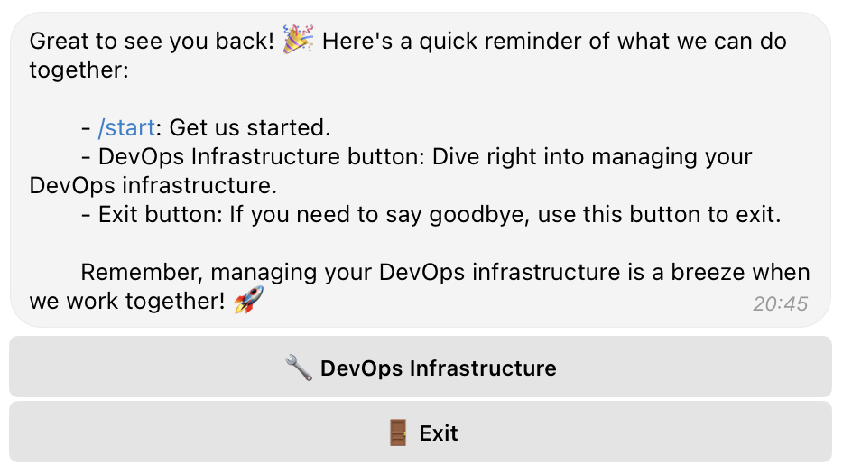
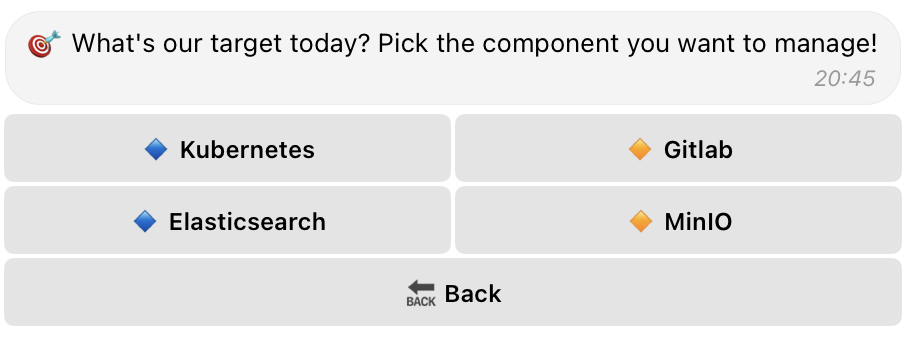
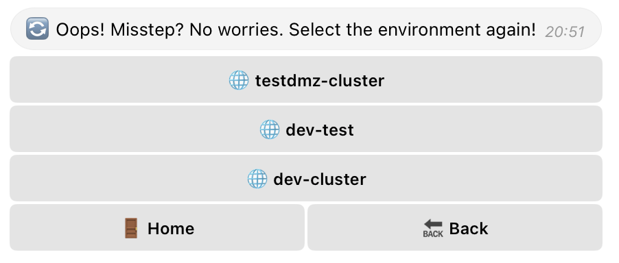
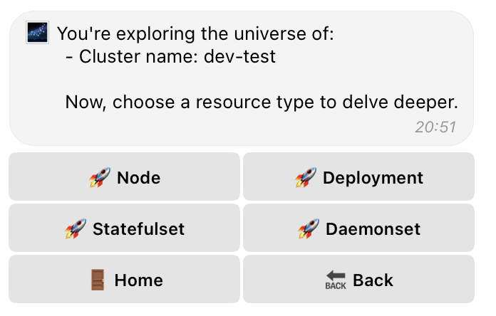
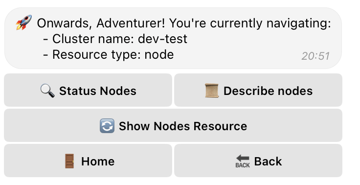
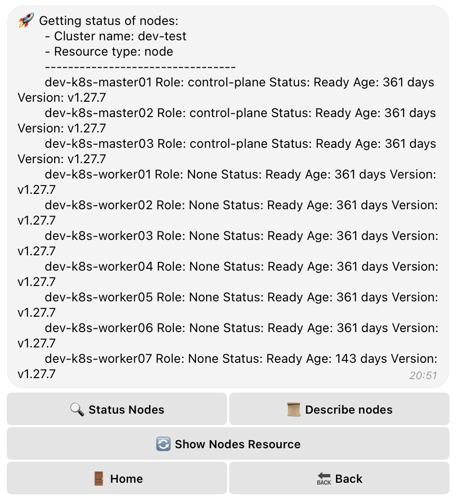
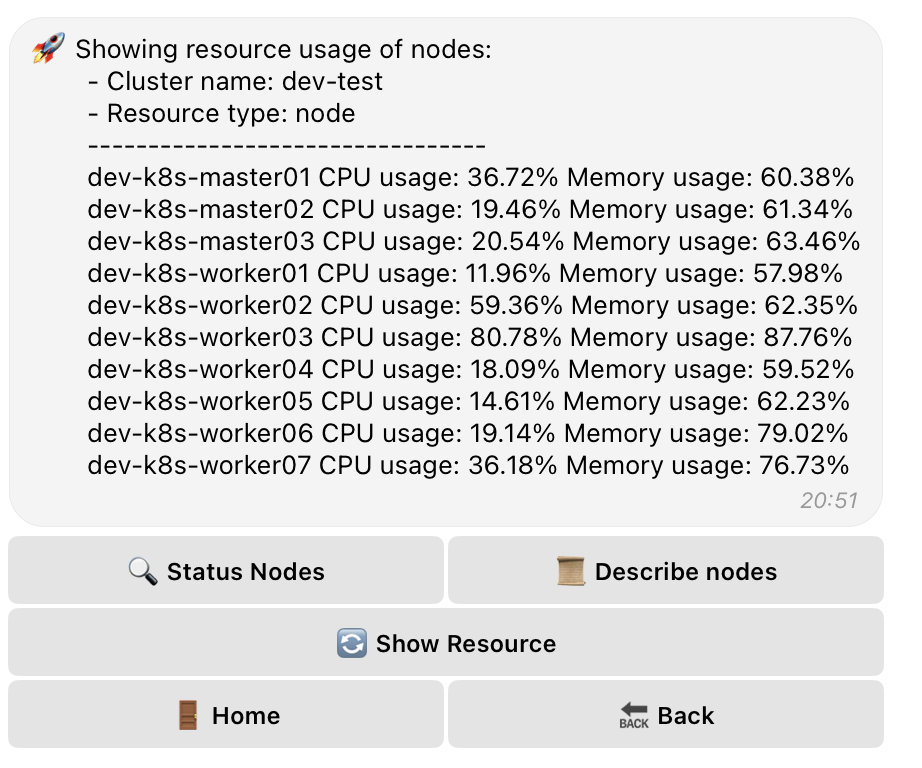

# DevOps ChatEngine Bot

## Overview

The DevOps ChatEngine Bot is an advanced Telegram bot designed to facilitate DevOps operations, with a strong emphasis on Kubernetes management. Users can leverage this bot to interactively manage their DevOps infrastructure, including deployments, monitoring, and executing Kubernetes operations directly within Telegram.

## Features

### General Features

- **Interactive Commands**: Execute DevOps tasks efficiently through Telegram.
- **Multi-Cluster Support**: Manage several Kubernetes clusters by switching contexts seamlessly.
- **Comprehensive Integration**: Works with Kubernetes (GitLab, Elasticsearch, MinIO in-progress) for a wide range of operations.

### Kubernetes Management

- **Cluster and Node Insights**: Monitor the status and health of Kubernetes clusters and nodes in real-time.
- **Deployment Operations**:
  - **Updates and Rollbacks**: Facilitate application updates and rollbacks to maintain system stability.
  - **Status Monitoring**: Ensure deployments are running smoothly with quick status checks.
- **Pod Management**:
  - **Logging**: Access application logs for monitoring and troubleshooting.
  - **Restarting**: Restart pods to apply changes or recover from errors.
- **Node Information**: Retrieve detailed node data, including resource capacity and workloads.
- **Namespace Handling**: Manage Kubernetes namespaces effectively for resource isolation.

### Folder structure:

Here is an overview of the project's folder structure and the purpose of each component:

- **constraints/**: Defines constants and configurations used throughout the bot.
    - **Cconstraints.py**: Contains global constants.
- **managers/**: Handles the logic for chat operations and Kubernetes interactions.
    - **chatops_manager.py**: Manages chat functionalities.
    - **kubernetes_manager.py**: Interfaces with Kubernetes API.
- **operations/**: Implements specific Kubernetes actions.
    - **kubernetes_action.py**: Executes Kubernetes operations.
- **states/**: Manages states for the bot's conversation logic.
    - **chat_states.py**: Defines conversation states.
- **utils/**: Provides utility functions.
    - **list_chunker.py**: For breaking lists into manageable chunks.
    - **logger_setup.py**: Configures logging.
- **settings/kube_config/**: Stores kubeconfig files for Kubernetes cluster access.
- **main.py**: The entry point to start the Telegram bot.

## Prerequisites

To use the DevOps ChatEngine Bot, you will need:

- Python 3.9+ installed.
- A Telegram bot token from BotFather.
- Kubernetes cluster access with configured `kubeconfig` files.

## Installation

1. **Clone the Repository**

```bash
git clone [repository URL]
cd devopschatenginee
```

2. **Install Poetry**

If you haven't installed Poetry yet, follow the instructions on the Poetry website.

3. **Install Dependencies Using Poetry**

After installing Poetry, set up the project dependencies:
```
poetry install
```
This command creates a virtual environment and installs all the necessary packages as defined in pyproject.toml.

4. **Configure Kubernetes kubeconfig**

Ensure your Kubernetes configuration files are located in settings/kube_config/.

5. **Set Up Your Telegram Bot Token**

Configure your bot token in main.py or as an environment variable.

## Usage

Activate the Poetry virtual environment and start bot:

```
poetry run python main.py
```

Interact with the bot in Telegram using the /start command and explore its functionalities through the inline keyboard prompts.

## Bot Interface Screenshots

Below are screenshots demonstrating the bot's interface and some of its functionalities:



### Component Management



The screen where users pick the component they want to manage, such as Kubernetes, GitLab, Elasticsearch, or MinIO.

### Environment Selection



In case of a misstep or to switch contexts, users can select the environment again from this menu.

### Resource Selection



Users can choose different types of resources to manage within the Kubernetes cluster.

### Navigation Menu



The bot provides a navigation menu for various operations such as checking node status, describing nodes, or showing node resources.

### Node Status Overview



This screenshot shows the status of all nodes in a selected Kubernetes cluster.

### Node Resource Usage



Here you can see the CPU and memory usage of each node within the cluster.

__Author Information__
------------------

Samir Nabadov